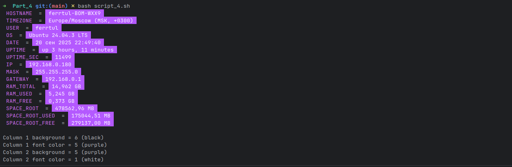
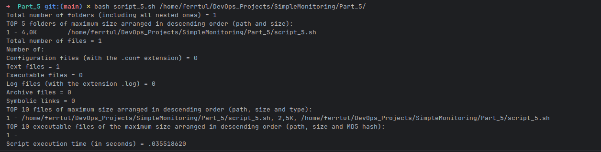

# Linux Monitoring v1.0

## Chapter I

### Bash

>Bash — это оболочка или интерпретатор командного языка для операционной системы GNU.
>
>Название является акронимом для «Bourne-Again SHell», каламбур в честь Стивена Борна, автора прямого предка нынешней оболочки Unix sh, которая появилась в седьмом издании исследовательской версии Unix для Bell Labs.
>
>Bash в значительной степени совместим с sh и включает в себя полезные функции из оболочки Korn ksh и оболочки C csh. Он предназначен для согласованной реализации части IEEE POSIX Shell and Tools спецификации IEEE POSIX (IEEE Standard 1003.1). Она предлагает функциональные улучшения по сравнению с sh как для интерактивного использования, так и для программирования.
>
>Хотя операционная система GNU предоставляет другие оболочки, включая версию csh, Bash является оболочкой по умолчанию. Как и другие программы GNU, Bash достаточно портативен. В настоящее время он работает почти на всех версиях Unix и некоторых других операционных системах — существуют независимо поддерживаемые порты для платформ MS-DOS, OS/2 и Windows.

### Shell

>В своей основе Shell (оболочка) — это просто макропроцессор, выполняющий команды.
>
>Unix shell — это и интерпретатор команд, и язык программирования. Как интерпретатор команд, shell обеспечивает пользовательский интерфейс к богатому набору утилит GNU. Файлы, содержащие команды, могут создаваться и сами становиться командами. Эти новые команды имеют тот же статус, что и системные команды. Это позволяет пользователям или группам создавать пользовательские среды для автоматизации своих обычных задач.
>
>Оболочки могут использоваться как в интерактивном, так и в неинтерактивном режиме. В интерактивном режиме они принимают ввод с клавиатуры. В неинтерактивном режиме оболочки выполняют команды, считываемые из файла.
>
>Оболочка позволяет выполнять команды GNU как синхронно, так и асинхронно.
>
>Хотя выполнение команд очень важно, большая часть мощности (и сложности) оболочек обусловлена встроенными в них языками программирования. Как и любой другой язык высокого уровня, оболочка предоставляет переменные, конструкции управления потоком, цитирование и функции.
>
>Оболочки предлагают функции, предназначенные для интерактивного использования, а не для дополнения языка программирования. К таким интерактивным возможностям относятся управление заданиями, редактирование командной строки, история команд и псевдонимы.

## Chapter II


## Part 1

Написали bash-скрипт. Скрипт запускается с одним параметром. Параметр текстовый.
Скрипт выводит значение параметра.
```
#!/bin/bash

if [ -z "$1" ]; then
echo "Error: parameter not specified"
exit 1
fi

if [[ "$1" =~ ^[0-9]+$ ]]; then
echo "Incorrect input: the parameter must not be a number."
else
echo "$1"
fi

```
Если параметр — число, то выводиться сообщение о некорректности ввода.

## Part 2
Скрипт который надо написать должен выводить на экран информацию в виде:
```
HOSTNAME = _сетевое имя_  
TIMEZONE = _временная зона в виде: **America/New_York UTC -5** (временная зона, должна браться из системы и быть корректной для текущего местоположения)_  
USER = _текущий пользователь, который запустил скрипт_  
OS = _тип и версия операционной системы_  
DATE = _текущее время в виде: **12 May 2020 12:24:36**_  
UPTIME = _время работы системы_  
UPTIME_SEC = _время работы системы в секундах_  
IP = _ip-адрес машины в любом из сетевых интерфейсов_  
MASK = _сетевая маска любого из сетевых интерфейсов в виде: **xxx.xxx.xxx.xxx**_  
GATEWAY = _ip шлюза по умолчанию_  
RAM_TOTAL = _размер оперативной памяти в Гб c точностью три знака после запятой в виде: **3.125 GB**_  
RAM_USED = _размер используемой памяти в Гб c точностью три знака после запятой_  
RAM_FREE = _размер свободной памяти в Гб c точностью три знака после запятой_  
SPACE_ROOT = _размер рутового раздела в Mб с точностью два знака после запятой в виде: **254.25 MB**_  
SPACE_ROOT_USED = _размер занятого пространства рутового раздела в Mб с точностью два знака после запятой_  
SPACE_ROOT_FREE = _размер свободного пространства рутового раздела в Mб с точностью два знака после запятой_
```
Для начала написали скрипт `system_info.sh` для сбора информации о системе:
```
#!/bin/bash

HOSTNAME=$(hostname)
TIMEZONE="$(timedatectl | grep "Time zone" | awk '{print $3, $4, $5}')"

USER=$(whoami)
OS=$(lsb_release -d | awk -F"\t" '{print $2}')
DATE=$(date +"%d %b %Y %H:%M:%S")

UPTIME=$(uptime -p)
UPTIME_SEC=$(cat /proc/uptime | awk '{print int($1)}')

CIDR=$(ip -o -f inet addr show | awk '/scope global/ {print $4}' | head -n1)
IP=${CIDR%/*}
MASK=$(ipcalc "$CIDR" | awk '/Netmask:/ {print $2}')
GATEWAY=$(ip route | awk '/default/ {print $3}')

RAM_TOTAL=$(free -m | awk '/Память:/ {printf "%.3f GB", $2/1024}')
RAM_USED=$(free -m | awk '/Память:/ {printf "%.3f GB", $3/1024}')
RAM_FREE=$(free -m | awk '/Память:/ {printf "%.3f GB", $4/1024}')

SPACE_ROOT=$(df / | tail -1 | awk '{printf "%.2f MB", $2/1024}')
SPACE_ROOT_USED=$(df / | tail -1 | awk '{printf "%.2f MB", $3/1024}')
SPACE_ROOT_FREE=$(df / | tail -1 | awk '{printf "%.2f MB", $4/1024}')
```
Потом данные полученные в скрипте выше загрузили в `main.sh`:

```
#!/bin/bash

source ./system_info.sh

    echo "HOSTNAME = $HOSTNAME"
    echo "TIMEZONE = $TIMEZONE"
    echo "USER = $USER"
    echo "OS = $OS"
    echo "DATE = $DATE"
    echo "UPTIME = $UPTIME"
    echo "UPTIME_SEC = $UPTIME_SEC"
    echo "IP = $IP"
    echo "MASK = $MASK"
    echo "GATEWAY = $GATEWAY"
    echo "RAM_TOTAL = $RAM_TOTAL"
    echo "RAM_USED = $RAM_USED"
    echo "RAM_FREE = $RAM_FREE"
    echo "SPACE_ROOT = $SPACE_ROOT"
    echo "SPACE_ROOT_USED = $SPACE_ROOT_USED"
    echo "SPACE_ROOT_FREE = $SPACE_ROOT_FREE"

echo
read -p "Save info? (Y/N): " answer

if [[ "$answer" == "Y" || "$answer" == "y" ]]; then
filename="$(date +"%d_%m_%y_%H_%M_%S").status"
print_info > "$filename"
echo "Info save in: $filename"
else
echo "Info don't save."
fi

```
После вывода данных сделали их запись в файл. Ответы **Y** и **y** будем считать положительными, все прочие — отрицательными.
При согласии пользователя в текущей директории пусть создается файл, содержащий информацию, которая была выведена на экран.  
Название файла имеет вид: **DD_MM_YY_HH_MM_SS.status** (Время в имени файла указывает момент сохранения данных).

## Part 3

Написали bash-скрипт. За основу взяли скрипт выше и уберали из него часть, ответственную за сохранение данных в файл.
Скрипт запускается с 4 параметрами. Параметры числовые от 1 до 6. 

Обозначения цветов: (1 — white, 2 — red, 3 — green, 4 — blue, 5 – purple, 6 — black)  
**Параметр 1** — это фон названий значений (HOSTNAME, TIMEZONE, USER и т. д.).  
**Параметр 2** — это цвет шрифта названий значений (HOSTNAME, TIMEZONE, USER и т. д.).  
**Параметр 3** — это фон значений (после знака '=').  
**Параметр 4** — это цвет шрифта значений (после знака '=').
```
#!/bin/bash

source ../Part_2/system_info.sh

if [[ $# -ne 4 ]]; then
echo "Usage: $0 <background_name> <font_name> <values_background> <values_font>"
echo "Colors: 1-white, 2-red, 3-green, 4-blue, 5-purple, 6-black"
exit 1
fi

bg_name=$1
fg_name=$2
bg_value=$3
fg_value=$4

# Прверяем чтобы цвета фона и значений не совпадали
if [[ $bg_name -eq $fg_name ]]; then
echo "Error: background color and font of the titles should different"
exit 1
fi

if [[ $bg_value -eq $fg_value ]]; then
echo "Error: background color and font of the titles should different"
exit 1
fi

# Массивы ANSI цветов для значений и фона
fg_colors=( "\e[97m" "\e[91m" "\e[92m" "\e[94m" "\e[95m" "\e[30m" )
bg_colors=( "\e[107m" "\e[101m" "\e[102m" "\e[104m" "\e[105m" "\e[40m" )
reset="\e[0m"

print_colored() {
local name=$1
local value=$2
echo -e "${bg_colors[$bg_name-1]}${fg_colors[$fg_name-1]} $name ${reset} = ${bg_colors[$bg_value-1]}${fg_colors[$fg_value-1]} $value ${reset}"
}

print_all_info() {
local vars=(
"HOSTNAME" "TIMEZONE" "USER" "OS" "DATE" "UPTIME" "UPTIME_SEC"
"IP" "MASK" "GATEWAY" "RAM_TOTAL" "RAM_USED" "RAM_FREE"
"SPACE_ROOT" "SPACE_ROOT_USED" "SPACE_ROOT_FREE"
)

    for var in "${vars[@]}"; do
        print_colored "$var" "${!var}"
    done
}

print_all_info
```

Цвета шрифта и фона одного столбца не должны совпадать. Поэтому сделали проверку, при соответсвии цветов выводится ошибка:`Error: background color and font of the titles should different`
```
# Прверяем чтобы цвета фона и значений не совпадали
if [[ $bg_name -eq $fg_name ]]; then
echo "Error: background color and font of the titles should different"
exit 1
fi

if [[ $bg_value -eq $fg_value ]]; then
echo "Error: background color and font of the titles should different"
exit 1
fi
```

## Part 4

Изменим скрипт из `Part 3` так, чтобы скрипт запускался без параметров. Параметры будут храниться в конфигурационном файле `color_config.cfg`
Цветовая схема остается такой же: (1 — white, 2 — red, 3 — green, 4 — blue, 5 – purple, 6 — black).
```
# Загружаем конфигурацию, если файл существует
if [[ -f "$CONFIG_FILE" ]]; then
source "$CONFIG_FILE"
fi

col1_bg=${column1_background:-$default_column1_background}
col1_fg=${column1_font_color:-$default_column1_font_color}
col2_bg=${column2_background:-$default_column2_background}
col2_fg=${column2_font_color:-$default_column2_font_color}
```

Конфигурационный файл по которому будет избираться цветовая палитра должен иметь вид:
```
column1_background=2
column1_font_color=4
column2_background=5
column2_font_color=1
```

Если один или несколько параметров не заданы в конфигурационном файле, то цвет ,будет подставляться из цветовой схемы, заданной по умолчанию:
```
default_column1_background=6
default_column1_font_color=1
default_column2_background=6
default_column2_font_color=1
```
Вывод скрипта аналогичен выводу в `Part_3`, за исключением вывода цветовой палитры:



## Part 5

Написали скрипт который выводит информацию о файловой системе. Принимается один параметр - это абсолютный или относительный путь до какой-либо директории. 
Параметр — это абсолютный или относительный путь до какой-либо директории. Параметр должен заканчиваться знаком '/', например:  
`script05.sh /var/log/`

Сделали проверки аргумента на краевые случаи для корректной отработки всех команд:

```
# Проверка на наличие аргумента
if [ $# -ne 1 ]; then
echo "Usage: $0 /path/to/directory/"
exit 1
fi

DIR="$1"

# Проверка, что путь оканчивается на '/'
if [[ "$DIR" != */ ]]; then
echo "Directory path must end with '/'"
exit 1
fi

# Проверка на существование директории
if [ ! -d "$DIR" ]; then
echo "Directory does not exist: $DIR"
exit 1
fi
```

Скрипт выводит следующую информацию о каталоге, указанном в параметре:
- Общее число папок, включая вложенные;
- Топ-5 папок с самым большим весом в порядке убывания (путь и размер);
- Общее число файлов;
- Число конфигурационных файлов (с расширением .conf), текстовых файлов, исполняемых файлов, логов (файлов с расширением .log), архивов, символических ссылок;
- Топ-10 файлов с самым большим весом в порядке убывания (путь, размер и тип);
- Топ-10 исполняемых файлов с самым большим весом в порядке убывания (путь, размер и хеш);
- Время выполнения скрипта.

Ниже представлен вывод скрипта:
